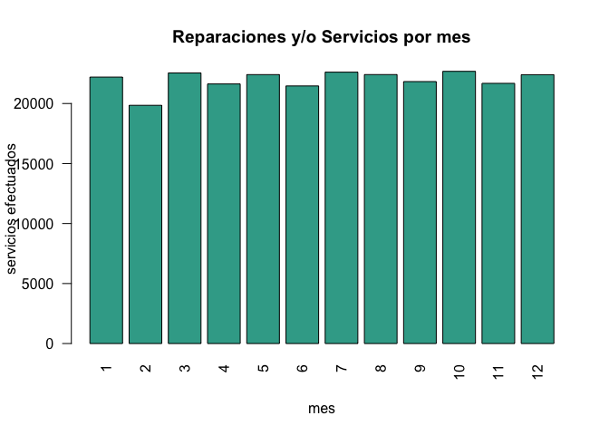
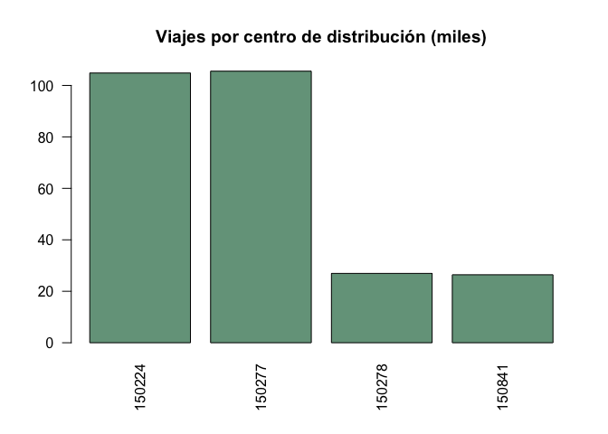
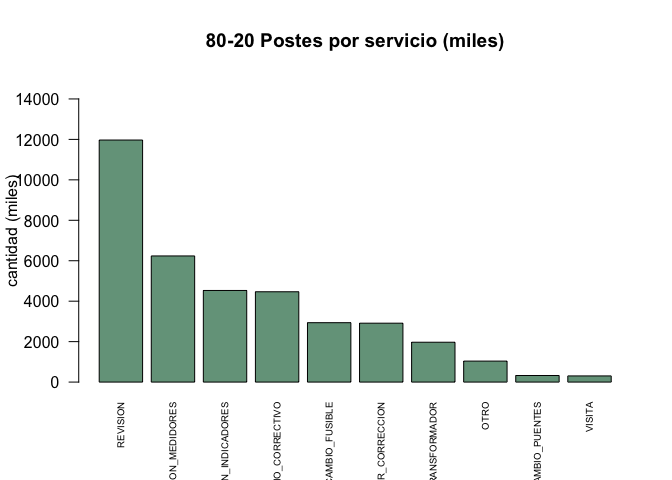
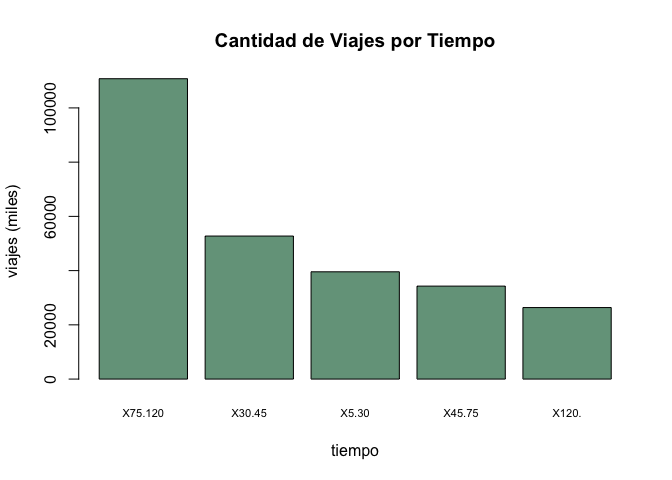

Energía, S.A.
================
Sophia Gamarro
10/11/2020

## LABORATORIO 7

Inversiones en Energía, S.A. de C.V. ha tenido un gran 2017 con una
utilidad superior a los US$1 Millones. Durante estos 9 meses del 2018,
han tenido una baja del 25% con respecto al año anterior en su margen
operativo y el gerente de operaciones ha sido despedido. Usted, como
consultor independiente, ha contactado al nuevo gerente para ofrecerle
un estudio del mercado como de la operación para que el siguiente año la
empresa pueda crecer por encima del 10% con respecto al 2018.

## Información General de Datos

  - Para facilitar el proceso de análisis es necesario limpiar la data
    proporcionada ya que se encuentra desordenada.

<!-- end list -->

``` r
data <- read.csv(file = "./c1.csv", header = TRUE)

data <- data %>% gather(Camion_5:Moto, key="transporte", value="costo_total", Camion_5:Moto)
```

    ## Warning: attributes are not identical across measure variables;
    ## they will be dropped

``` r
data <- filter(data, costo_total != " Q-   ")

data <- data %>% gather(directoCamion_5:directoMoto, key="transporte_costo_directo", value="costo_directo" ,directoCamion_5:directoMoto)
```

    ## Warning: attributes are not identical across measure variables;
    ## they will be dropped

``` r
data <- filter(data, costo_directo != " Q-   ")

data <- data %>% gather(fijoCamion_5:fijoMoto, key="transporte_costo_fijo", value="costo_fijo", fijoCamion_5:fijoMoto)
```

    ## Warning: attributes are not identical across measure variables;
    ## they will be dropped

``` r
data <- filter(data, costo_fijo != " Q-   ")


data <- data %>% gather(X5.30:X120., key="rangos", value="tiempo", X5.30:X120.)
data <- filter(data, tiempo == " x ")


data$Fecha <- parse_date_time(data$Fecha,orders="dmy")

data$factura <- as.numeric(gsub("Q", "", data$factura))
data$costo_total <- as.numeric(gsub("Q", "", data$costo_total))
data$costo_directo <- as.numeric(gsub("Q", "", data$costo_directo))
data$costo_fijo <- as.numeric(gsub("Q", "", data$costo_fijo))

data <- data %>% 
  mutate(Ganancia = factura-costo_total)

data$Camion_5 <- NULL
data$Pickup <- NULL
data$Moto <- NULL
data$directoCamion_5 <- NULL
data$directoPickup <- NULL
data$directoMoto <- NULL
data$fijoCamion_5 <- NULL
data$fijoPickup <- NULL
data$fijoMoto <- NULL
data$X5.30 <- NULL
data$X30.45 <- NULL
data$X45.75 <- NULL
data$X75.120 <- NULL
data$X120. <- NULL
data$X23 <- NULL 
```

``` r
head(data)
```

    ##        Fecha     ID                      Cod origen      Lat      Long factura
    ## 1 2017-01-16 767918   REVISION_TRANSFORMADOR 150277 14.80836 -89.27484   79.35
    ## 2 2017-06-14 386136                 REVISION 150224 15.54229 -90.17087  101.68
    ## 3 2017-05-03 588199 VERIFICACION_INDICADORES 150224 14.26695 -90.93225  118.86
    ## 4 2017-05-14 658299    VISITA_POR_CORRECCION 150277 14.30663 -89.67311   75.74
    ## 5 2017-09-11 860501    VISITA_POR_CORRECCION 150277 15.43937 -89.21016   81.29
    ## 6 2017-05-17 662960   REVISION_TRANSFORMADOR 150277 14.85318 -89.50079   90.54
    ##   height  X X.1 X.2 X.3 X.4 X.5 transporte costo_total transporte_costo_directo
    ## 1     12 NA  NA  NA  NA  NA  NA   Camion_5       40.35          directoCamion_5
    ## 2     12 NA  NA  NA  NA  NA  NA   Camion_5       34.68          directoCamion_5
    ## 3     14 NA  NA  NA  NA  NA  NA   Camion_5       52.86          directoCamion_5
    ## 4      8 NA  NA  NA  NA  NA  NA   Camion_5       53.74          directoCamion_5
    ## 5     10 NA  NA  NA  NA  NA  NA   Camion_5       46.29          directoCamion_5
    ## 6      8 NA  NA  NA  NA  NA  NA   Camion_5       41.54          directoCamion_5
    ##   costo_directo transporte_costo_fijo costo_fijo rangos tiempo Ganancia
    ## 1         24.61          fijoCamion_5      15.73  X5.30     x        39
    ## 2         20.81          fijoCamion_5      13.87  X5.30     x        67
    ## 3         32.77          fijoCamion_5      20.09  X5.30     x        66
    ## 4         34.39          fijoCamion_5      19.35  X5.30     x        22
    ## 5         31.01          fijoCamion_5      15.28  X5.30     x        35
    ## 6         28.25          fijoCamion_5      13.29  X5.30     x        49

Fue posible detectar que existe una relación entre las columnas que
indican el medio de transporte, las cuales son “Pickup”, “Camion\_5” y
“Moto”; las columnas que representan los costos fijos y directos de
los transportes antes mencionados y también una relación en las columnas
que indican un intervalo de tiempo.

Para obtener una representación correcta de los datos mencionados, se
generaron nuevas columnas que indican el costo final, costo directo,
tiempo y transporte las cuales permitirán obtener facilmente las
respuestas a las preguntas sobre los estados de resultados y eficiencia
de la forma de operar actual.

## Información

## Tipos de Servicio Disponibles

``` r
data %>% select(Cod) %>%distinct
```

    ##                         Cod
    ## 1    REVISION_TRANSFORMADOR
    ## 2                  REVISION
    ## 3  VERIFICACION_INDICADORES
    ## 4     VISITA_POR_CORRECCION
    ## 5         CAMBIO_CORRECTIVO
    ## 6                      OTRO
    ## 7    VERIFICACION_MEDIDORES
    ## 8            CAMBIO_FUSIBLE
    ## 9            CAMBIO_PUENTES
    ## 10                   VISITA

  - En la tabla anterior es posible observar los servicios que son
    proporcionados a los postes. \#\# Transporte utilizado

<!-- end list -->

``` r
data %>% count(transporte) %>%distinct
```

    ## # A tibble: 3 x 2
    ##   transporte      n
    ##   <chr>       <int>
    ## 1 Camion_5    62267
    ## 2 Moto         5725
    ## 3 Pickup     195733

  - Existen 3 tipos de transportes que pueden ser utilizados para
    movilizarse hacia el poste que necesita servicio. Estos son: -Moto
    -Camion -Pickup \#\# Origen

<!-- end list -->

``` r
data %>% select(origen) %>%distinct
```

    ##   origen
    ## 1 150277
    ## 2 150224
    ## 3 150841
    ## 4 150278

\-La empresa tiene 4 diferentes sedes.

## Pregunta 1: Estado de Resultados Breve 2017

``` r
ventas_totales <- sum(data$factura)
sprintf("Ventas Netas: %.2f", ventas_totales)
```

    ## [1] "Ventas Netas: 36688096.31"

``` r
costos <- sum(data$costo_total)
sprintf("Costo Total: %.2f", costos)
```

    ## [1] "Costo Total: 28174019.31"

``` r
ganancia <- ventas_totales - costos
sprintf("Utilidad Bruta: %.2f", ganancia)
```

    ## [1] "Utilidad Bruta: 8514077.00"

\-Para obtener el estado de resultados se realizó una sumatoria del
total de las facturas generadas por la emmpresa, la cual dio un total de
ventas de Q36,688,096.31

\-Para obtener los costos se sumaron los costos totales (los cuales se
componen de costos directos más costos fijos), lo cual dio como
resultado: Q28,174,019.31

\-Con los resultados de vetas totales y costos, fue posible determinar
que la utilidad bruta de la empresa fue de Q8,514,077.00

## Pregunta 2: Tarifario en el 2017 por Unidad

  - Para poder obtener el tarifario del 2017 por unidad, fue necesario
    generar un promedio de las facturas efectuadas por medio de
    transporte utilizado para realizar el
servicio.

<!-- end list -->

``` r
resultado_tarifario <- aggregate(x = data$factura, by=list(data$transporte), mean)
colnames(resultado_tarifario)<-c('Transporte', 'Tarifa')
resultado_tarifario
```

    ##   Transporte   Tarifa
    ## 1   Camion_5 184.0779
    ## 2       Moto 126.4685
    ## 3     Pickup 125.1812

  - El resultado indica que la tarifa promedio por camión es de Q184.07,
    la de moto es de Q126.46 y la de pickup
Q125.18.

## Pregunta 3: Las tarifas actuales ¿son aceptables por el cliente? ¿Estamos en números rojos?

\-Por los resultados obtenidos anteriormete en el estado de resultados
es posible determinar que no se está en números rojos, ya que la
utilidad bruta es positiva.

\-Para terminar si las tarifas actuales son aceptables por el cliente,
se generó una distribución de la cantidad de servicios realizados por
mes. Esto se realizó con el propósito de poder detectar la existencia de
algún tipo de tendencia a la baja en servicios o reparaciones
proporcionadas por la
empresa.

``` r
reparaciones_mes <- data %>%group_by(reparaciones_mes= month(Fecha)) %>%count(ID)
reparaciones_mes <- reparaciones_mes %>%group_by(reparaciones_mes) %>%summarise(total = sum(n))

reparaciones_mes 
```

    ## # A tibble: 12 x 2
    ##    reparaciones_mes total
    ##               <dbl> <int>
    ##  1                1 22202
    ##  2                2 19851
    ##  3                3 22547
    ##  4                4 21631
    ##  5                5 22410
    ##  6                6 21464
    ##  7                7 22613
    ##  8                8 22413
    ##  9                9 21829
    ## 10               10 22681
    ## 11               11 21681
    ## 12               12 22403

``` r
barplot(reparaciones_mes$total, names.arg = reparaciones_mes$reparaciones_mes, las=2, main="Reparaciones y/o Servicios por mes",  col="#38A897", xlab="mes", ylab = "servicios efectuados")
```

<!-- -->

\-En la gráfica anterior es posible observar como el volumen de
reparaciones y/o servicios por mes se mantuvo constante, lo cual es un
indicador de que los clientes sí se mantienen satisfechos con las
tarifas. También es posible observar que en el mes de febrero hubo una
pequeña disminución en el numero de servicios
brindados.

## Pregunta 4: ¿Cuándo podríamos perderle a un mantenimiento y/o reparación?

``` r
perdidas_mant_reparacion <- data %>% filter(Ganancia < 0) 
perdidas_mant_reparacion
```

    ##  [1] Fecha                    ID                       Cod                     
    ##  [4] origen                   Lat                      Long                    
    ##  [7] factura                  height                   X                       
    ## [10] X.1                      X.2                      X.3                     
    ## [13] X.4                      X.5                      transporte              
    ## [16] costo_total              transporte_costo_directo costo_directo           
    ## [19] transporte_costo_fijo    costo_fijo               rangos                  
    ## [22] tiempo                   Ganancia                
    ## <0 rows> (or 0-length row.names)

\-Es posible observar que no hubo algún tipo de pérdida, pero sí podrían
surgir por los siguientes factores:

\-Factor externo que provoque el aumento de costos fijos o variables.
-Cuando el precio por proporcionar algún servicio no cubra los costos
del mismo.

## Pregunta 5: ¿Debemos abrir más centros de distribución?

  - Para poder terminar si es necesario que se abran más centros de
    distribución, se realizó un conteo de la cantidad de servicios que
    despacha cada una de las sedes.

<!-- end list -->

``` r
distribucion <- count(data, data$origen)
colnames(distribucion)<-c('origen', 'Servicios')
distribucion$Servicios <- (distribucion$Servicios)/1000
```

``` r
barplot(distribucion$Servicios, names.arg = distribucion$origen, las=2, main="Viajes por centro de distribución (miles)",  col="#75A28A" )
```

<!-- -->

\-Como se puede observar en la gráfica, las sedes 150224 y 150277
realizan una cantidad de servicios mucho más alta que las demás, por lo
que sí sería adecuado abrir otra para que sea posible alivianar un poco
la carga de las sedes mencionadas.

## Estrategias a seguir:

\-Alteración en las tarifas actuales. Actualmente los clientes han
estado de acuerdo con las tarifas, por lo que se podría experimentar un
poco y aumentar el precio de las mismas.

\-Considerar la opción de contar con nuevos puntos de origen que
alivianen la carga de los centros de distribución que realizan más
servicios que los
demás.

## “80-20” de factura (puede variar el porcentaje) y cuáles postes requieren de más mantenimiento.

``` r
options(scipen = 999)     
mantenimiento<- data %>%group_by(Cod) %>%summarise(Total = sum(factura)/1000)
mantenimiento <- mantenimiento[order(-mantenimiento$Total),]
```

``` r
barplot(mantenimiento$Total, names.arg = mantenimiento$Cod, las=2, main="80-20 Postes por servicio (miles)", cex.names = 0.6, ylim = c(0,15000),  col="#75A28A", ylab= "cantidad (miles)")
```

<!-- -->

\-Se buscó una manera eficiente de agrupar los datos por tipo de
servicio brindado. Es posible observar en la gráfia que el servicio que
más ingresos representa el es servicio de “revisión”, seguido de
“verificación de medidores”.

``` r
data <- data %>% 
  group_by(rangos)


efectividad <- data  %>% summarise(
  n_servicios = length(ID),
  costo_total = sum(costo_total),
  ingreso = sum(factura),
  ganancia = (sum(factura) - sum(costo_total))) %>%
  arrange(desc(ganancia))
```

``` r
efectividad
```

    ## # A tibble: 5 x 5
    ##   rangos  n_servicios costo_total   ingreso ganancia
    ##   <chr>         <int>       <dbl>     <dbl>    <dbl>
    ## 1 X75.120      110764   13971119. 17577215. 3606096.
    ## 2 X30.45        52745    3616012.  5257839. 1641827 
    ## 3 X5.30         39559    1630675.  2841311. 1210636.
    ## 4 X45.75        34284    2990823.  4067009. 1076186 
    ## 5 X120.         26373    5965390.  6944722.  979332

En la tabla anterior se puede observar más detalladamente la cantidad de
servicios que se brindan en el intervalo de tiempo que mas ganancias
representa, así como tambiénn el costo total que
representan.

``` r
barplot(efectividad$n_servicios, names.arg = efectividad$rangos, main="Cantidad de Viajes por Tiempo", cex.names = 0.7, col="#75A28A", xlab= "tiempo", ylab= "viajes (miles)")
```

<!-- -->

Es posible identificar que los viajes más rentables son aquellos que se
encuentran en un rango de 75-120 minutos.
